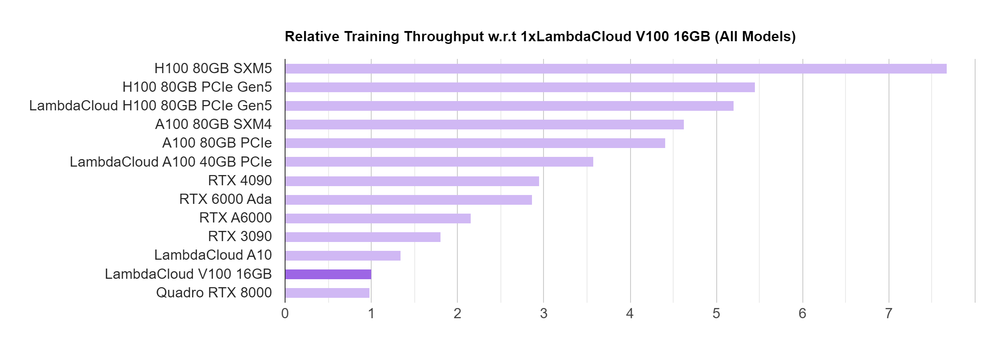
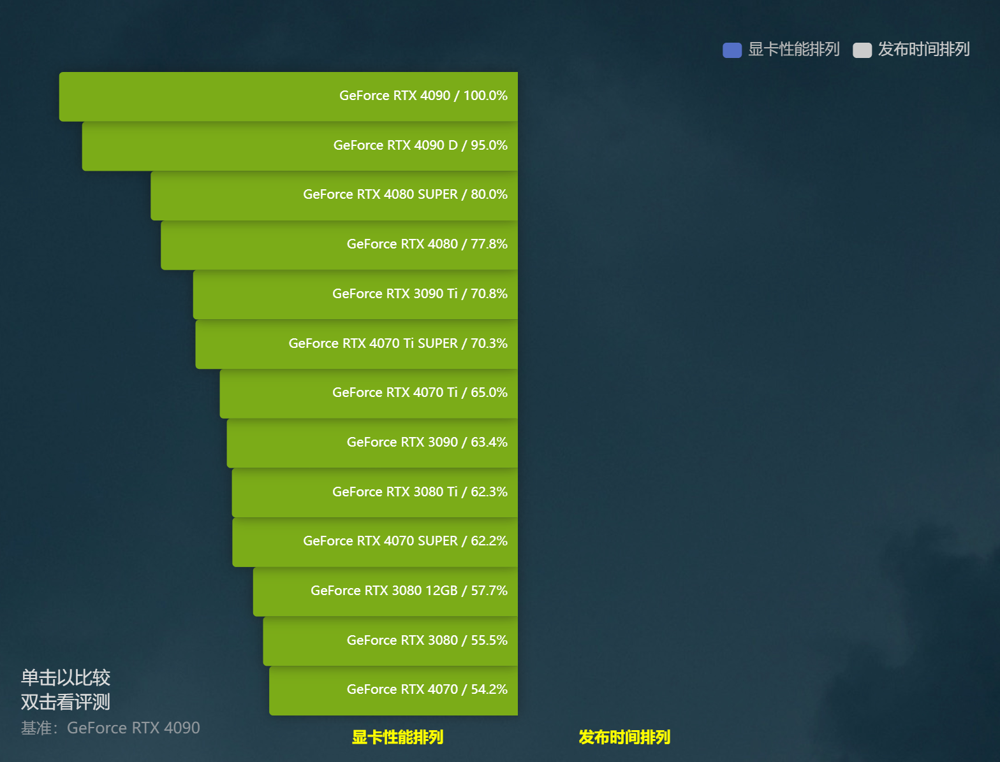

# 图形显卡（Graphics Processing Unit，GPU）
用于处理图形、图像相关任务的专用处理器，包括图像渲染、图形加速、三维模型处理、视频解码等目标。

图形显卡包含两个大类，集显和独显：

集显：集成显卡（Integrated Graphics），通常集成在中央处理器芯片中，即和 CPU 做在一块芯片里，是一个独立子模块。
独显：独立显卡（Discrete Graphics），是独立的显卡硬件，需要插在主机上的 PCIE 拓展插槽上。

例如 Intel 的 CPU 中大多带有集显，而带有 kf 结尾的型号如 13600kf、13700kf等，则是没有集显的版本。而苹果新的 M 系列芯片中，同样将 CPU 和显卡集成到一起，所以也是集显。

独显作为独立的硬件，体积更大，可以换来更好的性能，处理更重的任务。主流的独显显卡由两家企业主导，因为兼容性的差异所以要分成两个大类，即 NVIDIA 的 N 卡和 AMD 的 A 卡。

搭建深度学习服务器时，应当优先考虑涡轮显卡，涡轮显卡占的空间更小，且更助于散热，降低温度过高对于性能的影响。

对深度学习来说，显卡的内存的大小、算力水平是评价显卡性能的两个关键指标。

显存大小，会限制大规模模型的训练；算力水平与训练的耗时成正相关，在其他硬件保持一致的情况下，一般来说，显卡算力越高，训练速度越快。

参考链接：[显卡深度学习跑分测试](https://lambdalabs.com/gpu-benchmarks)

参考连接：[参考链接](https://topic.expreview.com/GPU/#)