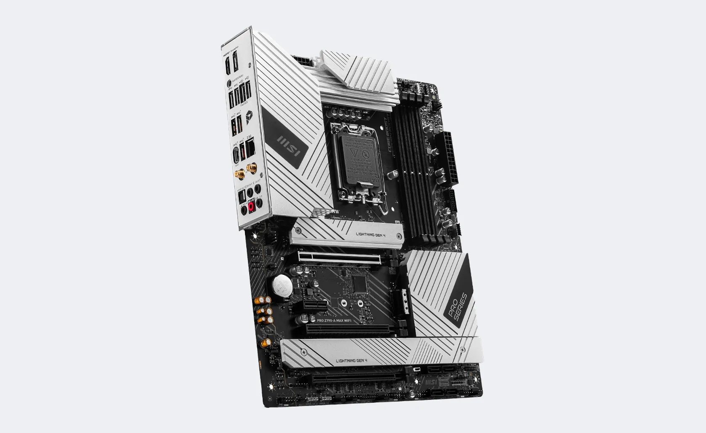
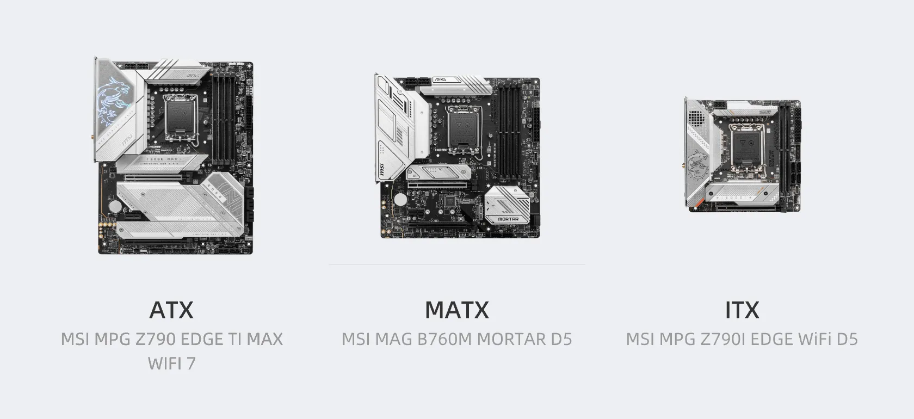

# 主板(Main Board)
一个用于将 CPU、内存、硬盘、显卡等独立硬件整合起来并实现正常运转的电路板，使得不同硬件发挥作用的基础平台。

主板接口可以分为：内部和外部硬件接口。

内部接口包括：CPU 内存、Sata、M.2、PCI-E、电源等，需要打开机箱并断电后插拔。

外部的硬件接口：裸露在机箱外的接口部分，如 USB、网口、音频、集显视频等接口。

主板主要以芯片组命名，芯片组即主板的内数据通信的方式，决定了可以支持什么样的处理器，由主板制造商和芯片制造商共同决定。同时，相同芯片组会包含不同等级规范，Intel H 入门、B 中端、Z 高端、Q 企业级， AMD 则是 A 入门、B 中端、X 高端，这两者共同决定了主板的面向对象。

以 Intel12 代酷睿为例，主板命名为 H610、B660、Z690。而13代酷睿低端主板沿用了12代的 H610，中高端才更新成了 B760、Z790； AMD 的 Zen 四代主板使用了 A620、B650、X670。

除了芯片、等级，主板还有尺寸上的差异，用于不同尺寸的机箱，主流的尺寸类型包含：

* ATX：305mm × 244mm（12 × 9.6英寸），最常见的主板类型，尺寸较接口较多兼容性最好。
* MATX：244mm × 244mm（9.6 × 9.6英寸），尺寸较小，适用于小型机箱，通常具备较好的兼容性。
* Mini-ITX：170mm × 170mm（6.7 × 6.7英寸），主板非常小巧，适用于紧凑型机箱，兼容性较差。

主板完整的名字，除了前面的等级和芯片组，还会加上尺寸的后缀。比如 Z790/Z790-A，就是标准 ATX 主板，Z790M 就是 MATX 主板，Z790I 就是 Mini-ITX 主板

主板需要注意：

* CPU 接口是否能对上，如 LGA1700 与 LGA206
* PCI-E 插槽的高度是否够插显卡，比如 PCI-E 插口之间的距离至少要满足双槽宽显卡的高度
* PCI-E 同时可以支持几张卡以什么样的速度运行，如 1x16 + 3x8 是常见的配置

### 主板必看参数

[GIGABYTE X299 AORUS MASTER \(rev. 1.0\)](https://www.gigabyte.cn/Motherboard/X299-AORUS-MASTER-rev-10) 使用了 4 组 2 槽间距显卡插槽设计，支持 1x16、2x16、2x16 + 1x8、1x16 + 3x8 四种配置（需要十核以上的 CPU），这里请参阅说明书安装显卡，安装在不同位置的速度是不一样的：

### 带有桥接芯片的主板

有的主板如 [Pro WS X299 SAGE II](https://www.asus.com.cn/Motherboards-Components/Motherboards/Workstation/Pro-WS-X299-SAGE-II/) 带有 PLX 桥接芯片，可以在 CPU 没有足够 PCI-E 的情况下达到四卡 x16 的速度：

在多卡并行训练的时候，PCI-E 的传输速度决定了梯度同步的速度，如果你训练的的模型比较大，希望搭建多卡机器，建议选择支持四路 PCI-E x16 的主板。